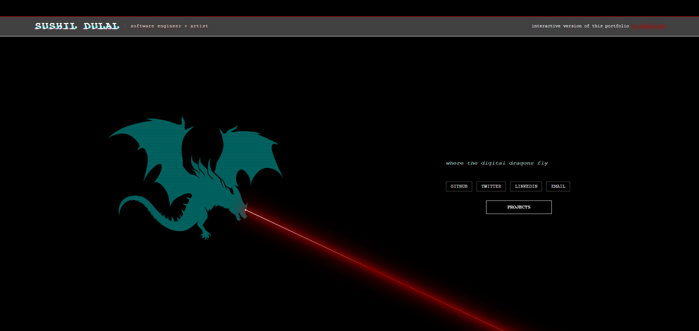

# sdulal.dev

<div align="center">
  <br />
    <a>
      
    </a>
  <br />
  <h3 align="center">https://sdulal.dev</h3>
</div>

## Quick Start:

```bash
# Install dependencies (only the first time)
npm install

# Run the local server at http://localhost:4200
ng serve

# The build artifacts will be stored in the `dist/` directory.
ng build
```
